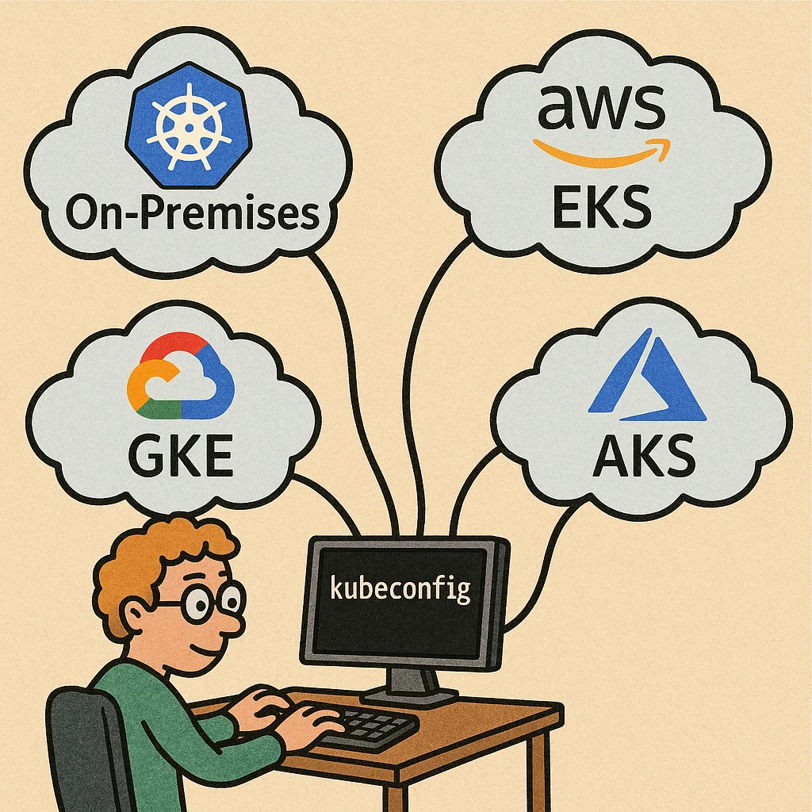
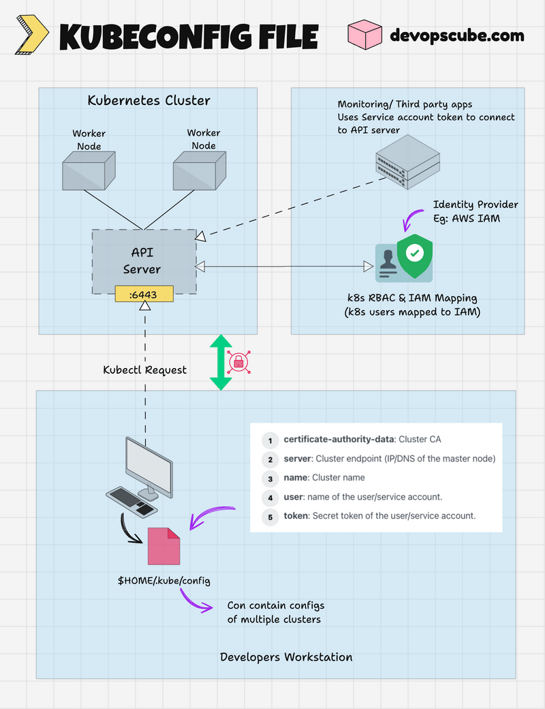

# AWS remote Kubernetes cluster

This hands-on exercise guides you through setting up a local connection to a remote Kubernetes cluster on AWS.

This will allow you to interact with the remote cluster using `kubectl` commands from your local machine together with
the `kubeconfig` file which contains the access configuration to the cluster in AWS.

<div style="text-align:center">
    
</div>

## Prerequisites

- kubectl installed on your local machine

## Configure remote access

1. Get the kubeconfig file called ` kubeconfig-token.yaml` (shared in the training Teams chat) and save it to
   your local machine
2. Try out the connection to the remote cluster by running (in the same folder where you saved the kubeconfig file):
   ```shell
    kubectl get pods -A --kubeconfig ./ kubeconfig-token.yaml
   ```
3. You should see the pods running in all namespaces of the remote cluster. If you get an error, please check:
   - if the kubeconfig file is in the correct location, and you are providing the correct path to it
>> The kubeconfig file contains the necessary information to connect to the remote cluster, including the cluster
endpoint, user credentials, and certificate data. See the diagram below for more details:

<div style="text-align:center">
    
</div>

4. For easier access to the remote cluster, you can do one of these alternatives:
    <details>
    <summary>WINDOWS 🧩 - change environment variable on terminal session</summary>
        set the `KUBECONFIG` environment variable to point to the kubeconfig file:
   
            ```
            $env:KUBECONFIG="C:\path\to\your\kubeconfig-token.yaml"
            ```
    </details>
   <details>
    <summary>LINUX/MAC 🧩 - change environment variable on terminal session</summary>
        set the `KUBECONFIG` environment variable to point to the kubeconfig file:
   
            ```
            export KUBECONFIG=/path/to/your/kubeconfig-token.yaml
            ```
    </details>

>> NOTE: the config above will be valid only fo the current terminal session!

5. Or add the new cluster config globally to the default kubeconfig
    ```shell
               export KUBECONFIG=~/.kube/<additionalConfig>:~/.kube/config  
               kubectl config view --merge --flatten > ~/.kube/merged_kubeconfig  
               mv ~/.kube/merged_kubeconfig ~/.kube/config
    ```
    - now you can list all the existing contexts: ```kubectl config get-contexts```
    - to change the context (take the name you want from the previous result): ```kubectl config use-context <context-name>```

## Interact with the cluster

Now you can run any `kubectl` command to interact with the remote cluster. For example, you can list all the nodes in the cluster:

```shell
 kubectl --kubeconfig .\kubeconfig-token.yaml get nodes
```
